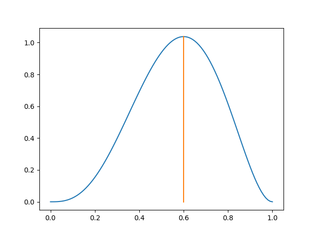

# Homework 2
Wenhe Li (wl1508)
## Problem 1
- a
  $$
    P(A \vert B) = \frac{P(A \cap B)}{P(B)} \\
    P(B \vert A) = \frac{P(A \cap B)}{P(A)}
  $$
  Given above equation:
  $$
    P(B \vert A)P(A) = P(A \vert B)P(B) \rArr P(A \vert B) = \frac{P(B \vert A)P(A)}{P(B)}
  $$
- b
  $$
  P(A,B,C) = P(A) P(B|A) P(C|A,B)
  $$
- c
  By defination, $\mathbb{E}[x] = P(A)*X_1 + (1-P(A))*X_2$, where $X_1 = 1 $ and $X_2 = 0$.
  Therefore, $\mathbb{E}[x] = P(A)$
- d
  - i
    From the table:
    $P(X=1) = \frac{7}{18}, P(X = 1 | Y = 0) = \frac{3}{8}$
    $P(X=1) \ne P(X = 1 | Y = 0)$
    Not independent.
  - ii
    $P(X=1|Y=1, Z=1) = \frac{1}{3} = P(X=1|Y=0, Z=1) = P(X=1 | Z=1)$
    $P(X=1|Y=1, Z=0) = \frac{1}{2} = P(X=1|Y=0, Z=0) = P(X=1 | Z=0)$
    Independent.
  - iii
    $P(X = 0 \vert X + Y > 0) = P(X = 0 | Y = 1) = \frac{25}{42}$

## Problem 2
- a
   $$
    L(\hat{\theta}) = \prod_{i=1}^n \theta^{x_i}*(1 - \theta)^{(1 - x_i)}
   $$
   Not depend on the order.
- b
  ```py
  import matplotlib.pyplot as plot

  def mle(D, theta):
      res = 1
      for d in D:
          res *= ((theta ** d) * ((1 - theta) ** (1 - d)))
      return res

  if __name__ == "__main__":
      D = [1] * 6 + [0] * 4
      init = 0
      xAxis = []
      yAxis = []
      maxX = 0
      maxY = 0
      while init <= 1.01:
          xAxis.append(init)
          yAxis.append(mle(D, init))
          if yAxis[-1] > maxY:
              maxY = yAxis[-1]
              maxX = xAxis[-1]
          init += .01
      plot.plot(xAxis, yAxis)
      plot.plot([maxX, maxX], [0, maxY])
      plot.show()
  ```
  
- c
  We define $n_1 = \# of X_i = 1$ and $n_2 = \# of X_i = 2$.
  $$
    L(\hat{\theta}) = \prod_{i=1}^n \theta^{x_i}*(1 - \theta)^{(1 - x_i)}
    \rArr L(\hat{\theta}) = \theta^{n_1} * (1-\theta)^{n_2} \\
  $$
  By putting `ln` on the equation:
  $$
    \ln{L(\hat{\theta})} = n_1\ln{\theta} + n_2\ln(1 - \theta)
  $$
  To find the argument that makes the function max, we derive it:
  $$
    \frac{d \ln{L(\hat{\theta})}}{d \theta} = \frac{n_1}{\theta} - \frac{n_2}{1 - \theta} = 0 \\ 
    \theta = \frac{n_1}{n_1 + n_2}
  $$
  It agrees with the plot. 
- d
  ```py
  import matplotlib.pyplot as plot

  def mapFunc(D, theta):
      res = 1
      for d in D:
          res *= ((theta) ** d) + ((1 - theta) ** (1 - d))
          beta = ((theta ** 2)*(1 - theta) ** 2) / .0333
          return res * beta

  if __name__ == "__main__":
      D = [1] * 6 + [0] * 4
      init = 0
      xAxis = []
      yAxis = []
      maxX = 0
      maxY = 0
      while init <= 1.01:
          xAxis.append(init)
          yAxis.append(mapFunc(D, init))
          if yAxis[-1] > maxY:
              maxY = yAxis[-1]
              maxX = xAxis[-1]
          init += .01
      plot.plot(xAxis, yAxis)
      plot.plot([maxX, maxX], [0, maxY])
      plot.show()
  ```

  
- e
  $$
  L(\hat{\theta})p(\hat{\theta}) = \frac{\theta^{n_1 + 2}(1 - \theta)^{n_2 + 2}}{B(3, 3)} \\
  \frac{d \ln L(\hat{\theta})p(\hat{\theta})}{d\theta} = \frac{n_1 + 2}{\theta} - \frac{n_2 + 2}{1 - \theta}
  \\
  \theta = \frac{n_1 + 2}{n_1 + n_2 + 4}
  $$

  It agreed with the plot.

- f
  MLE is a specific case of MLA where its prior $p(\theta)$ is 1
- g
  As $n \rarr \infty, \theta^{MAP} = \theta^{MLE}$. That is mainly becaseu that the prior distributation becomes less significant.