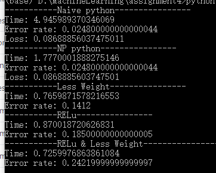

# Neural Network
Wenhe Li wl1508

Above is the screenshot for `execution time`, `error rate`, and `loss` (for naive py only)
By using numpy, we significantly reduce the `execution time` while doing matrix related operation.

By putting less weights, we make the model contian less information so that it will result in a drop of accuracy.
As for the `ReLu` activation, compared with `softmax`, it is more likely trapped to `zero` and not sensitive to numbers which are close and small, where `softmax` is more roboust in this case.
That's why `softmax` is better thatn `ReLu` and `Less Weight` will lead to a lower accuracy.