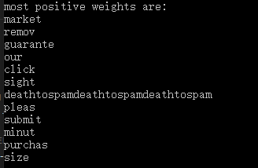
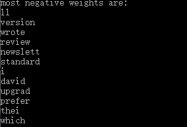
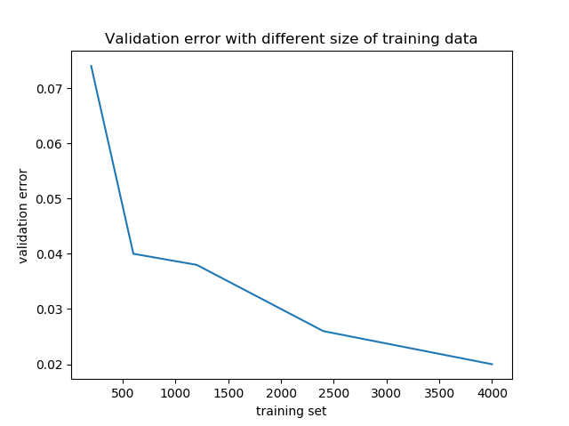
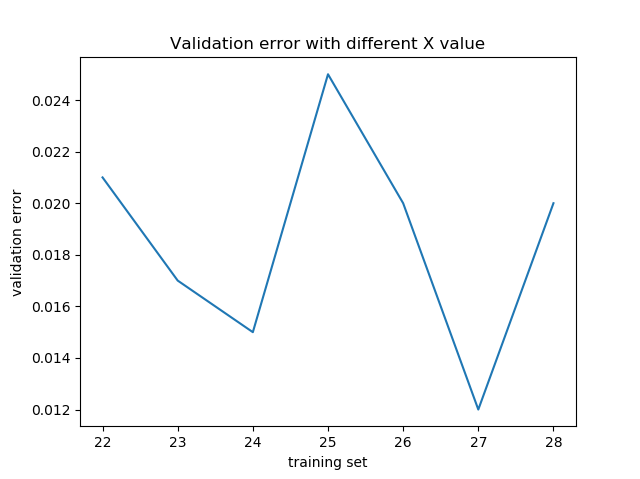

# HW1

## Program 1
- 1.3  
    After setting bias, it made `430` mistakes in total.
    The error rate on training set is `0`. And it is `0.02(2%)` on validation set.
- 1.4
    Postive words:
    

    Negative words:
    
- 1.5 
    

- 1.6
    
- 1.7
    Set a max iteration to 30.
- 1.8
    
    From the grpah, we can tell the best config is X = 27.
    And the error rate on the whole test-set is 0.012(1.2%).
- 1.9
  
   38 features(37 words plus a bias). Error rate is 0.169(16.9%).
   
   It is not separable. With such a huge number, we can only get a vector that describes the most common words among all email types. 
   Also, such a X also shows a huge validation error.
- 1.10
    By using the validatoin set, we can tune the hyper-parameter in our model like the `X` in our case.
    Also, bescuase the model has no prior-knowledge about the test dataset. We can get a more accurate benchmark on the test dataset.
## Problem 2
Let's take two arbitrary points from the hyperplane $x_1$ amd $x_2$.

Substitute the two points to the hyperplane, we will get:
$$
 w \cdot x_1 + b = 0
$$
$$
 w \cdot x_2 +b = 0 
$$

By doing subtrackion on above equations, we will get:
$$
    w \cdot (x_1 - x_2) = 0
$$
which shows, vector $w$ dot product any line in the plane equals zero and it means vector $w$ is perpendicular to the hyperplane.

## Problem 3
- Claim 2 :

    We have $w_t \rArr w_{t-1} + x_{t-1}y_{t-1}$

    $\rArr w_t\cdot w^* = (w_{t-1} + x_{t-1}y_{t-1})w^* = w_{t-1}w^* + y_{t-1}x_{t-1}w^*$.

    $\rArr y_iw^*x_i \ge \gamma$, then we know $w_tw^* = w_{t-1}w^* + y_{t-1}x_{t-1}w^* \ge w_{t-1}w^* + \gamma$.

    $\rArr w_tw^* \ge \gamma + w_{t-1}w^*$; 

    $\rArr w_{t-1}w^* \ge \gamma + w_{t-2}w^*$
    $$
        w_{t}w^* \ge \gamma + w_{t-1}w^* 
    $$
    $$
        w_{t-1}w^* \ge \gamma + w_{t-2}w^*
    $$

    By substituting them iteratively, we will have $w_t\cdot w^* \ge M_t\gamma$

    Claim 2 proof done.

    

- Claim 3:
    Given Claim2 & Claim3, we have:
    $$ {\lVert w_t \rVert}^2 \le M_tR^2  $$
    $$ w_t\cdot w^* \ge M_t \gamma$$
For second claim:
$$w_t\cdot w^* \ge M_t \gamma \rArr \lVert w_t \rVert \lVert w^* \rVert cos\theta \ge M_t\gamma$$
Since we know by defination, $\lVert W^* \rVert = 1$,
$$ w_t\cdot w^* \ge M_t \gamma \rArr \lVert w_t \rVert cos\theta \ge M_t\gamma \rArr {\lVert w_t \rVert}^2 {cos}^2\theta \ge {M_t}^2 {\gamma}^2  $$
We know that ${\lVert w_t \rVert}^2 \ge {\lVert w_t \rVert}^2{cos}^2\theta$,
$$ M_tR^2 \ge {M_t}^2{\gamma}^2 \rArr M_t \le \frac{R^2}{{\gamma}^2}$$

## Problem 4
By calculation, we know the $R^2$ for $X=26$ is $1114$. Also, we know the $M_t = 430$.
Therefore, we get $\gamma^2 \le \frac{R^2}{M_t} \rArr 0 \le \gamma \le 1.61$