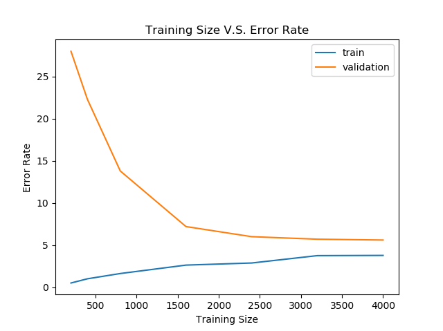
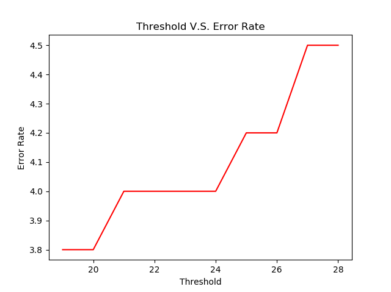
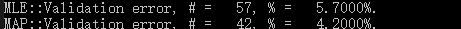

# Homework 3
Wenhe Li wl1508

## Problem 1

- a The validation error rate is $5.4\%$
- b
  
- c
  
  From the graph, we can tell that the best config for threshold is 23.
- d
  
  In this case the MLE is much better. This is mainly because of the small size of the dataset. 

  The over-simpified prior distributation imposed a wrong distributation to the classifier, which introduces extra error rate.
  