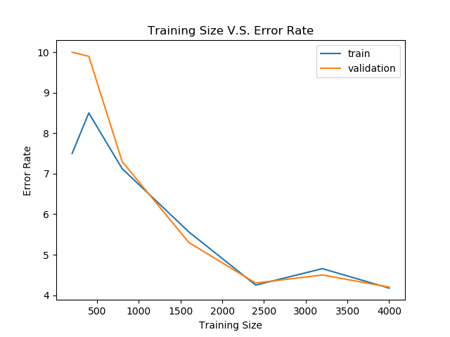

# Homework 3
Wenhe Li wl1508

## Problem 1
```bash
python problem-1.py spam_data/spam_train.txt
```
- a The validation error rate is $5.7\%$
- b
  
- c
  
  From the graph, we can tell that the best config for threshold is 23.
- d
  
  For this model we can see `MAP` performs better. Because we apply a prior to our data distributation,  we can gaurantee there is no `0`. Therefore, we can use `log` to avoid `0` problem and underflow to improve accuracy.
  Without MAP, we will get a `zero` in our expression which is a much strong bias that effect our accuracy.

## Problem 2
```bash
python problem-2.py spam_data/spam_train.txt
```
- a The validation error rate with MLE is $21.3\%$, $2.5\%$ with MAP.
- b 
- c 
    From the graph, we can tell from 20 - 26 the hyperparameter works best.
- d 
  
  The `MAP` performs better. 

## Problem 3
```bash
python problem-3.py spam_data/spam_train.txt
```
- a With MAP it can achieve $6.2\%$ error rate.
- b 
- c 
- d
  `MAP` is $6.2\%$
  `MLE` is $26.9\%$
  Beacuse by applying `MAP`, we can use `log` to prevent underflow from happening.

  Besides, by using `MAP` we can assure the mean and variance can not be zero to gaurantee our model is not poisioned by dirty data point.

## Probelm 4
The `perceptron` algorithm can only deal with a relatively low dimension of data distributation.

However, `Naive Bayes` applies a strong persumption that all features are independent. Besides, `Naive Bayes` is a generative model and `perceptron` is a discriminative model.

When it comes to `Gaussian Naive Bayes`, it makes an assumption that all features follow a Normal Distributation, which is a really strong assumption. Normally, some tasks that are required a continous features should use `GNB`.
